# Salesforce Skills for Agentic Coding Tools

[](https://opensource.org/licenses/MIT)
[](https://claude.ai/code)
[](https://www.salesforce.com/)

A collection of reusable skills for **Agentic Salesforce Development**, enabling AI-powered code generation, validation, testing, debugging, and deployment. Built for Claude Code with planned support for other agentic coding tools.

> **14 skills** • **50+ templates** • **420+ validation points** • **LSP integration**

> ⚠️ **Alpha Software** — This project is under active development. Expect breaking changes between releases. Pin to a specific commit hash for stability.

---

## 💡 What is a Skill?

> **Skills are portable knowledge packs that supercharge AI coding agents with domain expertise.**

Think of skills as "installable superpowers" for your agentic coding tool. Instead of repeatedly explaining Salesforce best practices to your AI assistant, a skill pre-loads that knowledge so the AI becomes an instant expert.

```
sf-apex/
├── SKILL.md              # 🧠 The brain - prompts & instructions
├── templates/            # 📁 Code templates & patterns
├── hooks/                # ✅ Validation scripts
└── examples/             # 📖 Usage examples
```

> 💡 **Tip:** Skills are open-source and composable. You can fork, customize, or create your own!

### Why Use Skills?

> 🚀 **Stop explaining Salesforce patterns. Start building.**

**1. Instant Expertise** — AI knows Trigger Actions Framework, Flow bulkification, deployment best practices from the first message.

**2. Automatic Validation** — Every Apex class, Flow, and agent script is scored against 100-150 point rubrics. Catch anti-patterns before deployment.

**3. Built-in Templates** — 50+ production-ready templates across Apex, Flow, Metadata, Agentforce, and more.

**4. Tool Orchestration** — "Deploy to production" becomes a single command. Skills handle `sf` CLI complexity.

**5. Context Efficiency** — Skills load only when invoked, saving ~2000 tokens per conversation vs. pasting prompts.

| Before | After |
|--------|-------|
| ❌ Prompt engineering every conversation | ✅ `Skill(skill="sf-apex")` |
| ❌ 10+ messages to explain requirements | ✅ 1 message, skill fills the gaps |
| ❌ Review code manually for issues | ✅ Hooks validate on every save |

---

## 🤖 Supported Agentic Coding Tools

| Tool | Status | Install Path | |
|------|--------|--------------|--|
| **Claude Code CLI** | ✅ Full Support | `.claude-plugin/` |  |
| **OpenCode CLI** | ✅ Installer | `.opencode/skill/` |  |
| **Codex CLI** | ✅ Installer | `.codex/skills/` |  |
| **Gemini CLI** | ✅ Installer | `~/.gemini/skills/` |  |
| **Amp CLI** | ✅ Compatible | `.claude/skills/` |  |
| **Droid CLI** | ✅ Installer | `.factory/skills/` |  |
| **Cursor CLI** | ✅ Installer | `.cursor/rules/` |  |
| **Agentforce Vibes** | ✅ Installer | `.clinerules/` |  |

> **Agent Skills Open Standard:** These skills follow the [Agent Skills specification](https://agentskills.io) for cross-CLI compatibility.

### CLI Compatibility Notes

<details open>
<summary><b>Claude Code</b> (Anthropic) — Full Native Support</summary>

Claude Code is the **recommended** platform for sf-skills with full native support for all features.

```bash
# Install via marketplace
/plugin marketplace add Jaganpro/sf-skills
```

- **Install Path:** `.claude-plugin/` (per-skill plugin structure)
- **Format:** Native SKILL.md with hooks, templates, and examples
- **Hooks:** ✅ Automatic validation on Write/Edit operations
- **LSP:** ✅ Real-time syntax validation with auto-fix loops
- **Templates:** ✅ Referenced dynamically (no duplication)
- **Tool Execution:** Local tools (Read, Write, Edit, Bash, Grep, Glob) — no MCP overhead
- **Docs:** [claude.ai/code](https://claude.ai/code)

**Why Claude Code for sf-skills:**
- **Zero-latency tools** — Local execution vs. MCP JSON-RPC roundtrips
- **Automatic hooks** — Validation runs on every file save without manual invocation
- **Context efficiency** — Skills load on-demand, saving ~2000 tokens per conversation
- **LSP integration** — Apex, Agent Script, and LWC syntax errors caught in real-time

</details>

#### Claude Code vs. Agentforce Vibes

| Feature | Claude Code | Agentforce Vibes |
|---------|-------------|------------------|
| **Skills System** | ✅ Native (`SKILL.md` + hooks + templates) | ❌ No skills — uses `.clinerules` markdown |
| **Automatic Hooks** | ✅ Validation on Write/Edit (150+ point rubrics) | ❌ No hooks — manual validation only |
| **LSP Integration** | ✅ Real-time Apex, Agent Script, LWC validation | ❌ No LSP — relies on external linters |
| **Tool Execution** | ✅ Local tools (zero latency) | ⚡ MCP-based (JSON-RPC overhead) |
| **Templates** | ✅ Dynamic references (50+ templates) | 📄 Inlined in markdown (larger file size) |
| **Context Window** | 200K tokens | Varies by model (GPT-5, SFR) |
| **Salesforce DX MCP** | ❌ Not needed (uses `sf` CLI directly) | ✅ 20+ tools for org connectivity |
| **Enterprise Features** | Community-driven | Trust Layer, audit logging |

> **Bottom line:** Claude Code offers deeper integration (hooks, LSP, local tools) for Salesforce development. Agentforce Vibes provides enterprise compliance and native Salesforce ecosystem integration via MCP.

<details>
<summary><b>OpenCode CLI</b> — Open-Source Claude Code Alternative</summary>

[OpenCode](https://github.com/opencode-ai/opencode) is an open-source alternative to Claude Code with skill support.

```bash
# Install all skills for OpenCode
python tools/installer.py --cli opencode --all
```

- **Install Path:** `.opencode/skill/` (project) or `~/.opencode/skill/` (global)
- **Format:** SKILL.md with scripts and templates
- **Hooks:** ⚠️ Manual execution (run `scripts/validate_*.py`)
- **Claude Compatibility:** Also reads `.claude/skills/` directory
- **Docs:** [github.com/opencode-ai/opencode](https://github.com/opencode-ai/opencode)

</details>

<details>
<summary><b>Codex CLI</b> (OpenAI) — GPT-Powered Coding Agent</summary>

[Codex CLI](https://github.com/openai/codex) is OpenAI's terminal-based coding agent.

```bash
# Install all skills for Codex
python tools/installer.py --cli codex --all
```

- **Install Path:** `.codex/skills/` (project) or `~/.codex/skills/` (global)
- **Format:** SKILL.md with `assets/` (templates) and `references/` (docs)
- **Hooks:** ⚠️ Manual execution (run `scripts/validate_*.py`)
- **Enable Skills:** `codex --enable skills`
- **Docs:** [github.com/openai/codex](https://github.com/openai/codex)

</details>

<details>
<summary><b>Gemini CLI</b> (Google) — 1M+ Token Context</summary>

[Gemini CLI](https://github.com/anthropics/gemini-cli) is Google's Gemini-powered terminal agent with massive context window.

```bash
# Install all skills for Gemini
python tools/installer.py --cli gemini --all
```

- **Install Path:** `~/.gemini/skills/` (user scope by default)
- **Format:** SKILL.md with scripts and templates
- **Hooks:** ⚠️ Manual execution (run `scripts/validate_*.py`)
- **Context:** 1M+ tokens — can load entire codebases
- **Symlink:** `ln -s ~/.gemini/skills/sf-apex ~/.claude/skills/sf-apex`
- **Docs:** [github.com/google-gemini/gemini-cli](https://github.com/google-gemini/gemini-cli)

</details>

<details>
<summary><b>Amp CLI</b> (Sourcegraph) — Claude Code Compatible</summary>

[Amp](https://sourcegraph.com/amp) is Sourcegraph's agentic coding tool, fully compatible with Claude Code skills.

```bash
# No installer needed — Amp reads Claude Code skills directly
# Place skills in .claude/skills/ directory
```

- **Install Path:** `.claude/skills/` (same as Claude Code)
- **Format:** Native Claude Code format (SKILL.md + hooks + templates)
- **Hooks:** ✅ Compatible with Claude Code hooks
- **Codebase Search:** Powered by Sourcegraph's code intelligence
- **Docs:** [sourcegraph.com/amp](https://sourcegraph.com/amp)

</details>

<details>
<summary><b>Droid CLI</b> (Factory.ai) — Claude Code Compatible</summary>

Droid CLI (v0.26.0+) natively supports Claude Code skills format. Use the installer or import directly:

```bash
# Install via installer
python tools/installer.py --cli droid --all

# Or Droid auto-discovers skills from .claude/skills/ directory
# Use the /skills command within Droid to manage skills
```

- **Install Path:** `.factory/skills/` or `~/.factory/skills/`
- **Format:** Claude Code compatible (SKILL.md + scripts/)
- **Prerequisite:** Enable Custom Droids in `/settings → Experimental`
- **Docs:** [docs.factory.ai/cli/configuration/skills](https://docs.factory.ai/cli/configuration/skills)

</details>

<details>
<summary><b>Cursor CLI</b> — Installer with MDC Transformation</summary>

Cursor CLI uses its own rules system (`.cursor/rules/` with MDC format). The installer transforms skills to Cursor's native format:

```bash
# Install skills transformed to MDC format
python tools/installer.py --cli cursor --all
```

- **Install Path:** `.cursor/rules/{name}.mdc`
- **Format:** MDC (Markdown with YAML frontmatter: description, globs, alwaysApply)
- **Templates:** Copied to `assets/`, docs to `references/`
- **Alternative:** [SkillPort](https://github.com/gotalab/skillport) MCP bridge for runtime skill access
- **Docs:** [docs.cursor.com/context/rules-for-ai](https://docs.cursor.com/context/rules-for-ai)

</details>

<details>
<summary><b>Agentforce Vibes</b> (Salesforce) — Enterprise Vibe-Coding Tool</summary>

[Agentforce Vibes](https://developer.salesforce.com/docs/platform/einstein-for-devs/guide/einstein-overview.html) is Salesforce's enterprise vibe-coding tool with strong Model Context Protocol (MCP) support.

```bash
# Install all skills for Agentforce Vibes
python tools/installer.py --cli agentforce-vibes --all
```

- **Install Path:** `.clinerules/` (project directory)
- **Format:** Pure markdown files with numeric prefixes (`01-sf-apex.md`, `02-sf-flow.md`, etc.)
- **Templates:** Inlined directly into markdown rules (self-contained)
- **Includes:** `/newrule` command references, Salesforce DX MCP Server tips
- **Docs:** [Agentforce Vibes Blog](https://developer.salesforce.com/blogs/2025/10/unleash-your-innovation-with-agentforce-vibes-vibe-coding-for-the-enterprise)

**Output Structure:**
```
.clinerules/
├── 01-sf-apex.md
├── 02-sf-flow.md
├── 03-sf-lwc.md
└── ... (13 skills total)
```

**Why Agentforce Vibes:** Strong MCP support enables integration with Salesforce DX MCP Server (20+ tools) for org connectivity, metadata operations, and deployment.

</details>

## ✨ Available Skills

| | Skill | Description | Category | Points | Status |
|--|-------|-------------|----------|--------|--------|
| ⚡ | **[sf-apex](sf-apex/)** | Apex generation, TAF patterns, LSP validation | 💻 Development | 150 | 🧪 Alpha |
| 🔄 | **[sf-flow](sf-flow/)** | Flow creation & bulk validation | 💻 Development | 110 | 🧪 Alpha |
| ⚡ | **[sf-lwc](sf-lwc/)** | Lightning Web Components, Jest tests, LMS | 💻 Development | 130 | 🆕 New |
| 🔍 | **[sf-soql](sf-soql/)** | Natural language → SOQL, query optimization | 💻 Development | 100 | 🆕 New |
| 🧪 | **[sf-testing](sf-testing/)** | Apex test runner, coverage, bulk testing | 🧪 Quality | 100 | 🆕 New |
| 🐛 | **[sf-debug](sf-debug/)** | Debug log analysis, governor limit fixes | 🧪 Quality | 90 | 🆕 New |
| 📋 | **[sf-metadata](sf-metadata/)** | Metadata gen & org queries | 📦 Foundation | 120 | 🧪 Alpha |
| 💾 | **[sf-data](sf-data/)** | SOQL & test data factories | 📦 Foundation | — | 🧪 Alpha |
| 🔐 | **[sf-connected-apps](sf-connected-apps/)** | OAuth apps & ECAs | 🔌 Integration | 120 | 🧪 Alpha |
| 🔗 | **[sf-integration](sf-integration/)** | Callouts, Events, CDC | 🔌 Integration | 120 | 🧪 Alpha |
| 🤖 | **[sf-ai-agentforce](sf-ai-agentforce/)** | Agent Script, Topics, Actions (API v64+) | 🤖 AI & Automation | 150 | 🧪 Alpha |
| 🚀 | **[sf-deploy](sf-deploy/)** | CI/CD automation (sf CLI v2) | 🚀 DevOps | — | 🧪 Alpha |
| 📊 | **[sf-diagram](sf-diagram/)** | Mermaid diagrams & ERD | 🛠️ Tooling | — | ✅ Stable |
| 🛠️ | **[skill-builder](skill-builder/)** | Skill creation wizard | 🛠️ Tooling | — | ✅ Stable |

## 🚀 Installation

### Claude Code (Recommended)

Add the marketplace to Claude Code:

```bash
/plugin marketplace add Jaganpro/sf-skills
```

### Other CLIs (OpenCode, Codex, Gemini, Droid, Cursor, Agentforce Vibes)

Use the installer script to transform and install skills for other agentic CLIs:

```bash
# Clone the repository
git clone https://github.com/Jaganpro/sf-skills
cd sf-skills

# Install all skills for a specific CLI
python tools/installer.py --cli opencode --all         # OpenCode
python tools/installer.py --cli codex --all            # Codex (OpenAI)
python tools/installer.py --cli gemini --all           # Gemini (Google)
python tools/installer.py --cli droid --all            # Droid (Factory.ai)
python tools/installer.py --cli cursor --all           # Cursor (MDC format)
python tools/installer.py --cli agentforce-vibes --all # Agentforce Vibes (Salesforce)

# Install specific skills
python tools/installer.py --cli gemini --skills sf-apex sf-flow sf-deploy

# Auto-detect installed CLIs and install all skills
python tools/installer.py --detect --all

# List available skills and CLIs
python tools/installer.py --list
python tools/installer.py --list-clis
```

The installer:
- Transforms SKILL.md for CLI compatibility (MDC for Cursor, markdown for Agentforce Vibes)
- Bundles shared modules for self-contained installation
- Exports validation hooks as standalone scripts (where supported)
- Inlines templates for Agentforce Vibes (self-contained rules)
- Generates README with manual validation instructions

See [tools/README.md](tools/README.md) for detailed installer documentation.

## 🎬 Video Tutorials

| Video | Description |
|-------|-------------|
| [How to Add/Install Skills](https://youtu.be/a38MM8PBTe4) | Install the sf-skills marketplace and add skills to Claude Code |
| [Skills Demo & Walkthrough](https://www.youtube.com/watch?v=gW2RP96jdBc) | Live demo of Apex, Flow, Metadata, and Agentforce skills in action |

## 🔗 Skill Architecture

```mermaid
%%{init: {"flowchart": {"nodeSpacing": 80, "rankSpacing": 70}} }%%
flowchart TB
    subgraph ai["🤖 AI & AGENTS"]
        agentforce["🤖 sf-ai-agentforce"]
    end

    subgraph integration["🔌 INTEGRATION & SECURITY"]
        connectedapps["🔐 sf-connected-apps"]
        sfintegration["🔗 sf-integration"]
        diagram["📊 sf-diagram"]
    end

    subgraph development["💻 DEVELOPMENT"]
        apex["⚡ sf-apex"]
        flow["🔄 sf-flow"]
        lwc["⚡ sf-lwc"]
        soql["🔍 sf-soql"]
    end

    subgraph quality["🧪 QUALITY"]
        testing["🧪 sf-testing"]
        debug["🐛 sf-debug"]
    end

    subgraph foundation["📦 FOUNDATION"]
        metadata["📋 sf-metadata"]
        data["💾 sf-data"]
    end

    subgraph devops["🚀 DEVOPS"]
        deploy["🚀 sf-deploy"]
    end

    subgraph tooling["🔧 TOOLING"]
        skillbuilder["🛠️ skill-builder"]
    end

    %% AI & Agent relationships
    agentforce -->|"flow actions"| flow
    agentforce -->|"API actions"| sfintegration
    agentforce -->|"GenAiFunction"| apex

    %% Integration relationships
    sfintegration -->|"OAuth apps"| connectedapps
    sfintegration -->|"callouts"| apex
    sfintegration -->|"HTTP Callout"| flow
    connectedapps -->|"permissions"| metadata
    diagram -->|"schema"| metadata
    diagram -.->|"documents"| connectedapps
    diagram -.->|"documents"| sfintegration

    %% Development relationships
    apex -->|"schema"| metadata
    flow -->|"schema"| metadata
    lwc -->|"@wire"| apex
    lwc -->|"schema"| metadata
    soql -->|"queries"| data
    apex -.->|"test data"| data
    flow -.->|"test data"| data

    %% Quality relationships
    testing -->|"validates"| apex
    testing -.->|"test data"| data
    debug -->|"fixes"| apex

    %% Foundation relationships
    data -->|"structure"| metadata

    %% Deployment - all skills can deploy via sf-deploy
    apex -->|"deploy"| deploy
    flow -->|"deploy"| deploy
    lwc -->|"deploy"| deploy
    metadata -->|"deploy"| deploy
    sfintegration -->|"deploy"| deploy
    connectedapps -->|"deploy"| deploy
    agentforce -->|"deploy"| deploy

    %% Styling - AI (pink-200)
    style agentforce fill:#fbcfe8,stroke:#be185d,color:#1f2937

    %% Styling - Integration (orange-200/teal-200/sky-200)
    style connectedapps fill:#fed7aa,stroke:#c2410c,color:#1f2937
    style sfintegration fill:#99f6e4,stroke:#0f766e,color:#1f2937
    style diagram fill:#bae6fd,stroke:#0369a1,color:#1f2937

    %% Styling - Development (violet-200/indigo-200)
    style apex fill:#ddd6fe,stroke:#6d28d9,color:#1f2937
    style flow fill:#c7d2fe,stroke:#4338ca,color:#1f2937
    style lwc fill:#e9d5ff,stroke:#7c3aed,color:#1f2937
    style soql fill:#c4b5fd,stroke:#5b21b6,color:#1f2937

    %% Styling - Quality (lime-200)
    style testing fill:#d9f99d,stroke:#65a30d,color:#1f2937
    style debug fill:#bef264,stroke:#4d7c0f,color:#1f2937

    %% Styling - Foundation (cyan-200/amber-200)
    style metadata fill:#a5f3fc,stroke:#0e7490,color:#1f2937
    style data fill:#fde68a,stroke:#b45309,color:#1f2937

    %% Styling - DevOps (emerald-200)
    style deploy fill:#a7f3d0,stroke:#047857,color:#1f2937

    %% Styling - Tooling (slate-200)
    style skillbuilder fill:#e2e8f0,stroke:#334155,color:#1f2937

    %% Subgraph styling
    style ai fill:#fdf2f8,stroke:#be185d,stroke-dasharray:5
    style integration fill:#fff7ed,stroke:#c2410c,stroke-dasharray:5
    style development fill:#f5f3ff,stroke:#6d28d9,stroke-dasharray:5
    style quality fill:#f7fee7,stroke:#65a30d,stroke-dasharray:5
    style foundation fill:#ecfeff,stroke:#0e7490,stroke-dasharray:5
    style devops fill:#ecfdf5,stroke:#047857,stroke-dasharray:5
    style tooling fill:#f8fafc,stroke:#334155,stroke-dasharray:5
```



### 🚀 Deployment

**Use the sf-deploy skill for all Salesforce deployments:**

```
Skill(skill="sf-deploy", args="Deploy to [org]")
```

## 🔌 Plugin Features

### Automatic Validation Hooks

Each skill includes validation hooks that run automatically on **Write** and **Edit** operations:

| | Skill | File Type | Validation |
|--|-------|-----------|------------|
| ⚡ | sf-apex | `*.cls`, `*.trigger` | 150-pt scoring + Code Analyzer + LSP |
| 🔄 | sf-flow | `*.flow-meta.xml` | 110-pt scoring + Flow Scanner |
| ⚡ | sf-lwc | `*.js`, `*.html` (LWC) | 130-pt scoring + LSP |
| 🔍 | sf-soql | `*.soql` | 100-pt scoring + selectivity checks |
| 🧪 | sf-testing | `*Test.cls` | 100-pt scoring + coverage analysis |
| 🐛 | sf-debug | Debug logs | 90-pt scoring + governor analysis |
| 📋 | sf-metadata | `*.object-meta.xml`, `*.field-meta.xml` | Metadata best practices |
| 💾 | sf-data | `*.apex`, `*.soql` | SOQL patterns, governor limits |
| 🤖 | sf-ai-agentforce | `*.agent`, `*.genAiFunction-meta.xml` | Agent Script syntax + LSP |
| 🔐 | sf-connected-apps | `*.connectedApp-meta.xml` | OAuth security |
| 🔗 | sf-integration | `*.namedCredential-meta.xml` | Callout patterns |
| 🛠️ | skill-builder | `SKILL.md` | YAML frontmatter |

#### 🔬 Code Analyzer V5 Integration

Hooks integrate [Salesforce Code Analyzer V5](https://developer.salesforce.com/docs/platform/salesforce-code-analyzer) for OOTB linting alongside custom scoring:

| Engine | What It Checks | Dependency |
|--------|----------------|------------|
| **PMD** | 55 Apex rules (85% coverage) — security, bulkification, complexity, testing | Java 11+ |
| **SFGE** | Data flow analysis, path-based security | Java 11+ |
| **Regex** | Trailing whitespace, hardcoded patterns | None |
| **ESLint** | JavaScript/LWC linting | Node.js |
| **Flow Scanner** | Flow best practices | Python 3.10+ |

**Custom Validation Coverage:**
| Validator | Total Checks | Categories |
|-----------|--------------|------------|
| **Apex** (150-pt) | PMD 55 rules + Python 8 checks | Security (100%), Bulkification, Testing, Architecture, Clean Code, Error Handling, Performance, Documentation |
| **Flow** (110-pt) | 32+ checks (21/24 LFS rules) | Design/Naming, Logic/Structure, Error Handling, Architecture, Security, Performance |

**Graceful Degradation:** If dependencies are missing, hooks run custom validation only and show which engines were skipped.

#### 🔤 Language Server Protocol (LSP) Integration

Skills leverage official Salesforce LSP servers for real-time syntax validation with auto-fix loops:

| | Skill | File Type | LSP Server | Runtime |
|--|-------|-----------|------------|---------|
| 🤖 | sf-ai-agentforce | `*.agent` | Agent Script Language Server | Node.js 18+ |
| ⚡ | sf-apex | `*.cls`, `*.trigger` | apex-jorje-lsp.jar | Java 11+ |
| ⚡ | sf-lwc | `*.js`, `*.html` | @salesforce/lwc-language-server | Node.js 18+ |

**How Auto-Fix Loops Work:**
1. Claude writes/edits a file
2. LSP hook validates syntax (~500ms)
3. If errors found → Claude receives diagnostics and auto-fixes
4. Repeat up to 3 attempts

**Prerequisites:** VS Code with Salesforce extensions installed (LSP servers are bundled with the extensions).

**Sample Output:**
```
🔍 Apex Validation: AccountService.cls
════════════════════════════════════════════════════════════════════════════════
📊 Score: 138/150 ⭐⭐⭐⭐ Very Good
   (Custom: 145, CA deductions: -7)

📋 Category Breakdown:
   ✅ Security: 25/25
   ✅ Bulkification: 25/25
   ⚠️ Testing: 20/25 (-5)
   ✅ Architecture: 20/20

🔬 Code Analyzer: pmd, regex (2847ms)

❗ Issues Found (3):
   🟠 HIGH [CA:pmd] L30: Validate CRUD permission before DML
   🟠 HIGH [CA:pmd] L45: Avoid empty catch blocks
   🔵 INFO [CA:regex] L12: Trailing whitespace
════════════════════════════════════════════════════════════════════════════════
```

Hooks provide **advisory feedback** — they inform but don't block operations.

## 🔧 Prerequisites

**Required:**
- **Claude Code** (latest version)
- **Salesforce CLI** v2.x (`sf` command)
- **Python 3.10+** (for validation hooks)

**Optional** (enables additional features):

*Code Analyzer engines:*
- **Java 11+** — Enables PMD, CPD, SFGE engines (`brew install openjdk@11`)
- **Node.js** — Enables ESLint, RetireJS for LWC (`brew install node`)
- **Code Analyzer plugin** — `sf plugins install @salesforce/sfdx-code-analyzer`

*LSP real-time validation (auto-fix loops):*
- **VS Code with Salesforce Extensions** — LSP servers are bundled with VS Code extensions
  - Agent Script: Install "Agent Script" extension by Salesforce
  - Apex: Install "Salesforce Extension Pack"
  - LWC: Install "Salesforce Extension Pack" (includes LWC Language Server)
- **Java 11+** — Required for Apex LSP (same as Code Analyzer)
- **Node.js 18+** — Required for Agent Script and LWC LSP

<details>
<summary><h2>💬 Usage Examples</h2></summary>

### ⚡ Apex Development
```
"Generate an Apex trigger for Account using Trigger Actions Framework"
"Review my AccountService class for best practices"
"Create a batch job to process millions of records"
"Generate a test class with 90%+ coverage"
```

### 🔄 Flow Development
```
"Create a screen flow for account creation with validation"
"Build a record-triggered flow for opportunity stage changes"
"Generate a scheduled flow for data cleanup"
```

### 📋 Metadata Management
```
"Create a custom object called Invoice with auto-number name field"
"Add a lookup field from Contact to Account"
"Generate a permission set for invoice managers with full CRUD"
"Create a validation rule to require close date when status is Closed"
"Describe the Account object in my org and list all custom fields"
```

### 💾 Data Operations
```
"Query all Accounts with related Contacts and Opportunities"
"Create 251 test Account records for trigger bulk testing"
"Insert 500 records from accounts.csv using Bulk API"
"Generate test data hierarchy: 10 Accounts with 3 Contacts each"
"Clean up all test records created today"
```

### ⚡ LWC Development
```
"Create a datatable component to display Accounts with sorting"
"Build a form component for creating new Contacts"
"Generate a Jest test for my accountCard component"
"Create an Apex controller with @AuraEnabled methods for my LWC"
"Set up Lightning Message Service for cross-component communication"
```

### 🔍 SOQL Queries
```
"Query all Accounts with more than 5 Contacts"
"Get Opportunities by Stage with total Amount per Stage"
"Find Contacts without Email addresses"
"Optimize this query: SELECT * FROM Account WHERE Name LIKE '%Corp%'"
"Generate a SOQL query to find duplicate Leads by Email"
```

### 🧪 Testing
```
"Run all Apex tests in my org and show coverage"
"Generate a test class for my AccountTriggerHandler"
"Create a bulk test with 251 records for trigger testing"
"Generate mock classes for HTTP callouts"
"Run tests for a specific class and show failures"
```

### 🐛 Debugging
```
"Analyze this debug log for performance issues"
"Find governor limit violations in my log"
"What's causing this SOQL in loop error?"
"Show me how to fix this null pointer exception"
"Optimize my Apex for CPU time limits"
```

### 🔐 Connected Apps & OAuth
```
"Create a Connected App for API integration with JWT Bearer flow"
"Generate an External Client App for our mobile application with PKCE"
"Review my Connected Apps for security best practices"
"Migrate MyConnectedApp to an External Client App"
```

### 🔗 Integration & Callouts
```
"Create a Named Credential for Stripe API with OAuth client credentials"
"Generate a REST callout service with retry and error handling"
"Create a Platform Event for order synchronization"
"Build a CDC subscriber trigger for Account changes"
"Set up an External Service from an OpenAPI spec"
```

### 🤖 Agentforce Agents & Actions
```
"Create an Agentforce agent for customer support triage"
"Build a FAQ agent with topic-based routing"
"Generate an agent that calls my Apex service via Flow wrapper"
"Create a GenAiFunction for my @InvocableMethod Apex class"
"Build an agent action that calls the Stripe API"
"Generate a PromptTemplate for case summaries"
```

### 📊 Diagrams & Documentation
```
"Create a JWT Bearer OAuth flow diagram"
"Generate an ERD for Account, Contact, Opportunity, and Case"
"Diagram our Salesforce to SAP integration flow"
"Create a system landscape diagram for our Sales Cloud implementation"
"Generate a role hierarchy diagram for our sales org"
```

### 🚀 Deployment
```
"Deploy my Apex classes to sandbox with tests"
"Validate my metadata changes before deploying to production"
```

### 🛠️ Skill Creation
```
"Create a new Claude Code skill for code analysis"
```

</details>

<details>
<summary><h2>🗺️ Roadmap</h2></summary>

### Naming Convention
```
sf-{capability}           # Cross-cutting (apex, flow, admin)
sf-ai-{name}              # AI features (agentforce, copilot)
sf-product-{name}         # Products (datacloud, omnistudio)
sf-cloud-{name}           # Clouds (sales, service)
sf-industry-{name}        # Industries (healthcare, finserv)
```

### 🔧 Cross-Cutting Skills
| | Skill | Description | Status |
|--|-------|-------------|--------|
| 🔐 | `sf-connected-apps` | Connected Apps, ECAs, OAuth configuration | ✅ Live |
| 🔗 | `sf-integration` | Named Credentials, External Services, REST/SOAP, Platform Events, CDC | ✅ Live |
| 📊 | `sf-diagram` | Mermaid diagrams for OAuth, ERD, integrations, architecture | ✅ Live |
| ⚡ | `sf-lwc` | Lightning Web Components, Jest, LMS | ✅ Live |
| 🔍 | `sf-soql` | Natural language to SOQL, optimization | ✅ Live |
| 🧪 | `sf-testing` | Test execution, coverage, bulk testing | ✅ Live |
| 🐛 | `sf-debug` | Debug log analysis, governor fixes | ✅ Live |
| 🔒 | `sf-security` | Sharing rules, org-wide defaults, encryption | 📋 Planned |
| 📦 | `sf-migration` | Org-to-org, metadata comparison | 📋 Planned |

### 🤖 AI & Automation
| | Skill | Description | Status |
|--|-------|-------------|--------|
| 🤖 | `sf-ai-agentforce` | Agent Script, Topics, Actions (API v64+) | ✅ Live |
| 🧠 | `sf-ai-copilot` | Einstein Copilot, Prompts | 📋 Planned |
| 🔮 | `sf-ai-einstein` | Prediction Builder, NBA | 📋 Planned |

### 📦 Products
| | Skill | Description | Status |
|--|-------|-------------|--------|
| ☁️ | `sf-product-datacloud` | Unified profiles, segments | 📋 Planned |
| 🎨 | `sf-product-omnistudio` | FlexCards, DataRaptors | 📋 Planned |

### ☁️ Clouds
| | Skill | Description | Status |
|--|-------|-------------|--------|
| 💰 | `sf-cloud-sales` | Opportunities, Quotes, Forecasting | 📋 Planned |
| 🎧 | `sf-cloud-service` | Cases, Omni-Channel, Knowledge | 📋 Planned |
| 🌐 | `sf-cloud-experience` | Communities, Portals | 📋 Planned |

### 🏢 Industries
| | Skill | Description | Status |
|--|-------|-------------|--------|
| 🏥 | `sf-industry-healthcare` | FHIR, Care Plans, Compliance | 📋 Planned |
| 🏦 | `sf-industry-finserv` | KYC, AML, Wealth Management | 📋 Planned |
| 💵 | `sf-industry-revenue` | CPQ, Billing, Revenue Lifecycle | 📋 Planned |

**Total: 24 skills** (14 skills ✅ live, 10 planned 📋)

</details>

## Contributing

1. Fork the repository
2. Create a feature branch
3. Make your changes
4. Test with `/plugin install ./your-skill`
5. Open a Pull Request

See [CONTRIBUTING.md](CONTRIBUTING.md) for detailed guidelines.

## Issues & Support

- [GitHub Issues](https://github.com/Jaganpro/sf-skills/issues)

## License

MIT License - Copyright (c) 2024-2025 Jag Valaiyapathy
