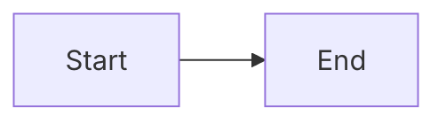
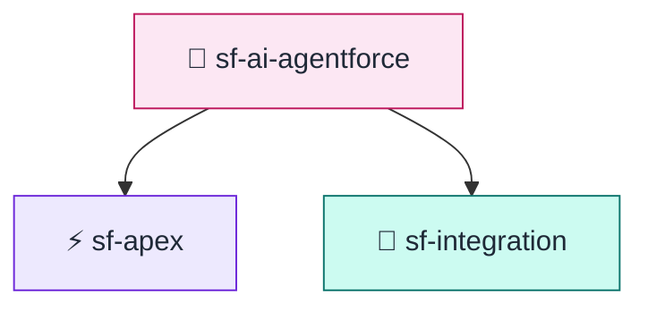
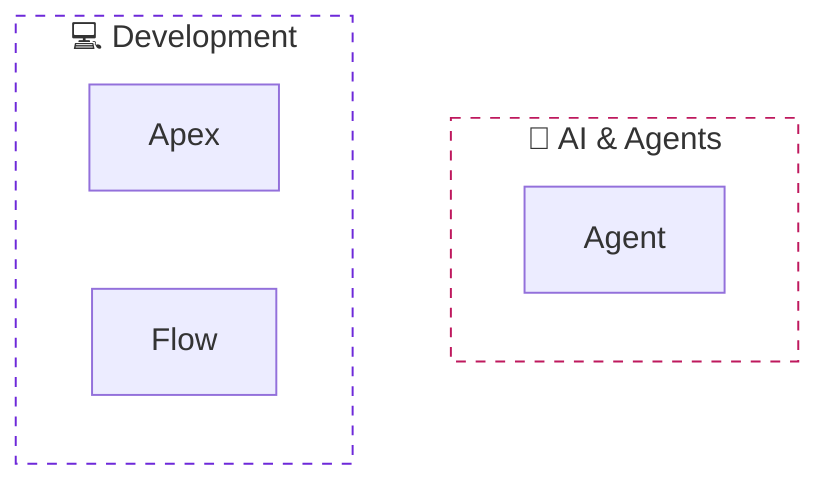
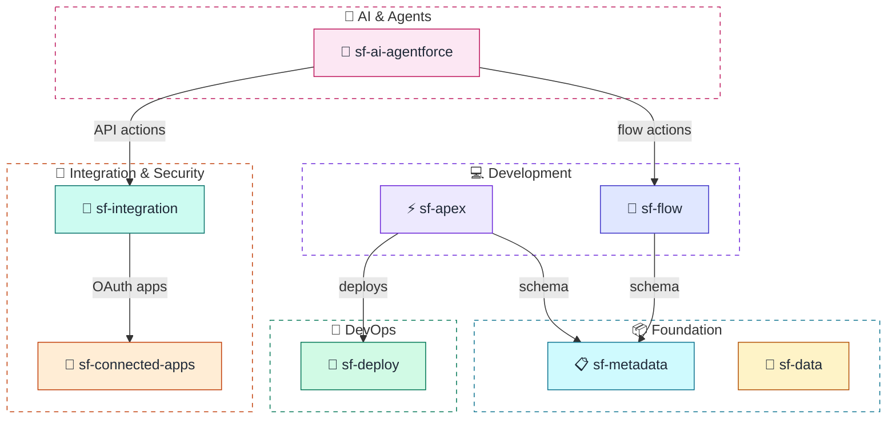

# sf-diagram Color Palette

Soft, pastel color palette with darker borders for clear definition. Inspired by modern UI design patterns.

## Primary Palette (Pastel + Dark Borders)

```
┌─────────────────────────────────────────────────────────────────────────────┐
│  COMPONENT                │  PASTEL FILL │  DARK STROKE │  TEXT COLOR      │
├───────────────────────────┼──────────────┼──────────────┼──────────────────┤
│  AI & Agents              │  #fce7f3     │  #be185d     │  #1f2937         │
│  Integration (Orange)     │  #ffedd5     │  #c2410c     │  #1f2937         │
│  Integration (Teal)       │  #ccfbf1     │  #0f766e     │  #1f2937         │
│  Diagrams (Sky)           │  #e0f2fe     │  #0369a1     │  #1f2937         │
│  Apex/Development         │  #ede9fe     │  #6d28d9     │  #1f2937         │
│  Flow/Automation          │  #e0e7ff     │  #4338ca     │  #1f2937         │
│  Metadata (Cyan)          │  #cffafe     │  #0e7490     │  #1f2937         │
│  Data (Amber)             │  #fef3c7     │  #b45309     │  #1f2937         │
│  Deploy (Green)           │  #d1fae5     │  #047857     │  #1f2937         │
│  Tooling (Slate)          │  #f1f5f9     │  #334155     │  #1f2937         │
└───────────────────────────┴──────────────┴──────────────┴──────────────────┘
```

**Design Philosophy**:
- **Pastel fills** (Tailwind 100-level shades) give a soft, translucent appearance
- **Dark strokes** (Tailwind 700-800 level) provide clear definition
- **Dark text** (`#1f2937`) ensures readability on light backgrounds

## Salesforce-Specific Colors

```
┌─────────────────────────────────────────────────────────────────────────────┐
│  SALESFORCE COMPONENT     │  PASTEL FILL │  DARK STROKE │  TEXT COLOR      │
├───────────────────────────┼──────────────┼──────────────┼──────────────────┤
│  Salesforce Brand         │  #e0f2fe     │  #0369a1     │  #1f2937         │
│  Connected Apps/OAuth     │  #ffedd5     │  #c2410c     │  #1f2937         │
│  External Systems         │  #d1fae5     │  #047857     │  #1f2937         │
│  Users/Actors             │  #ede9fe     │  #6d28d9     │  #1f2937         │
│  Platform Events          │  #ccfbf1     │  #0f766e     │  #1f2937         │
│  Named Credentials        │  #ffedd5     │  #c2410c     │  #1f2937         │
└───────────────────────────┴──────────────┴──────────────┴──────────────────┘
```

## Status Colors

```
┌─────────────────────────────────────────────────────────────────────────────┐
│  STATUS                   │  PASTEL FILL │  DARK STROKE │  ICON           │
├───────────────────────────┼──────────────┼──────────────┼─────────────────┤
│  Success                  │  #d1fae5     │  #047857     │  ✅             │
│  Error/Failure            │  #fee2e2     │  #b91c1c     │  ❌             │
│  Warning                  │  #fef3c7     │  #b45309     │  ⚠️             │
│  Info/Neutral             │  #f1f5f9     │  #334155     │  ℹ️             │
│  In Progress              │  #dbeafe     │  #1d4ed8     │  ⏳             │
└───────────────────────────┴──────────────┴──────────────┴─────────────────┘
```

---

## Font Family Options

Mermaid supports custom fonts via `%%{init}`:

```
%%{init: { "fontFamily": "Inter, sans-serif", "fontSize": "14px" }}%%
```

### Available Font Options

| Font | Configuration | Best For |
|------|---------------|----------|
| **Default** | `"trebuchet ms", verdana, arial` | General use (Mermaid default) |
| **Modern** | `"Inter", sans-serif` | Clean, professional diagrams |
| **System** | `-apple-system, "Segoe UI", sans-serif` | Native OS appearance |
| **Monospace** | `"Fira Code", "Consolas", monospace` | Code-focused diagrams |
| **Serif** | `"Georgia", serif` | Document-style diagrams |

### Usage Example



**⚠️ Limitation**: GitHub and VS Code may override custom fonts with their platform defaults.

---

## Mermaid Styling Approach

### Preferred: Individual Node Styling

Use `style` declarations with pastel fills and dark strokes:



### Subgraph Styling

Use transparent backgrounds with dark dashed borders:



---

## Node Label Patterns

### Simple Label (Recommended)

```
["🤖 sf-ai-agentforce"]
```

Keep labels short for consistent rendering.

### Database/Cylinder

```
[(💾 Database)]
```

---

## Complete Style Template

Copy this template for consistent diagrams with the pastel color scheme:



### Label Guidelines

| ✅ DO | ❌ DON'T |
|-------|---------|
| `["🤖 sf-ai-agentforce"]` | `["🤖 sf-ai-agentforce<br/><small>Agent Script</small>"]` |
| `["⚡ sf-apex"]` | `["⚡ sf-apex<br/>Triggers, Services"]` |
| Short edge labels: `"schema"` | Long labels: `"queries schema for validation"` |

**Why?** Multi-line labels with `<br/>` and `<small>` tags render inconsistently across GitHub, VS Code, and other Mermaid viewers, often causing text cutoff.

---

## Icon Reference

| Category | Icon | Unicode | Usage |
|----------|------|---------|-------|
| AI/Agents | 🤖 | U+1F916 | Agentforce, AI features |
| Apex | ⚡ | U+26A1 | Code, triggers, services |
| Flow | 🔄 | U+1F504 | Automation, flows |
| Metadata | 📋 | U+1F4CB | Objects, fields |
| Data | 💾 | U+1F4BE | SOQL, records |
| Deploy | 🚀 | U+1F680 | CI/CD, deployment |
| Connected Apps | 🔐 | U+1F510 | OAuth, security |
| Integration | 🔗 | U+1F517 | Named Creds, callouts |
| Diagram | 📊 | U+1F4CA | Documentation |
| Tooling | 🛠️ | U+1F6E0 | Utilities |
| User | 👤 | U+1F464 | End users |
| Browser | 🌐 | U+1F310 | Web apps |
| Cloud | ☁️ | U+2601 | Salesforce platform |
| External | 🏭 | U+1F3ED | External systems |
| Database | 💾 | U+1F4BE | Data storage |

---

## Color Blind Accessibility

This palette maintains distinguishability for common color blindness:

| Condition | Our Approach |
|-----------|--------------|
| Protanopia | Pink vs Teal have different luminance |
| Deuteranopia | Orange vs Cyan are well separated |
| Tritanopia | Icons + dark text supplement colors |

### Key Principles

1. **Icons supplement colors** - Every node has an icon
2. **High contrast text** - Dark text (`#1f2937`) on pastel backgrounds
3. **Dark stroke differentiation** - Bold borders add definition
4. **Dashed subgraphs** - Pattern, not just color

---

## Light/Dark Mode Support

The pastel style works best on **light backgrounds**. For dark mode contexts:
- Pastel fills remain visible
- Dark strokes provide clear definition
- Consider using the darker color variant if needed

---

## References

- [Tailwind CSS Color Palette](https://tailwindcss.com/docs/colors)
- [Salesforce Lightning Design System](https://www.lightningdesignsystem.com/)
- [CloudSundial Diagrams](https://cloudsundial.com/diagrams-of-identity-flows-in-context)
- [Mermaid Theme Configuration](https://mermaid.js.org/config/theming.html)
