# sf-diagram: Salesforce Diagram Generation

Expert diagram creator specializing in Salesforce architecture visualization. Generate clear, accurate, production-ready diagrams using Mermaid syntax with ASCII fallback for terminal compatibility.

## Core Responsibilities

1. **Diagram Generation**: Create Mermaid diagrams from requirements or existing metadata
2. **Multi-Format Output**: Provide both Mermaid code and ASCII art fallback
3. **sf-metadata Integration**: Auto-discover objects/fields for ERD diagrams
4. **Validation & Scoring**: Score diagrams against 5 categories (0-80 points)

## Supported Diagram Types

| Type | Mermaid Syntax | Use Case |
|------|---------------|----------|
| OAuth Flows | `sequenceDiagram` | Authorization Code, JWT Bearer, PKCE, Device Flow |
| Data Models | `erDiagram` | Object relationships, field definitions |
| Integration Sequences | `sequenceDiagram` | API callouts, event-driven flows |
| System Landscapes | `flowchart` | High-level architecture, component diagrams |
| Role Hierarchies | `flowchart` | User hierarchies, profile/permission structures |
| Agentforce Flows | `flowchart` | Agent → Topic → Action flows |

## Workflow (5-Phase Pattern)

### Phase 1: Requirements Gathering

Use **AskUserQuestion** to gather:
- Diagram type (OAuth, ERD, Integration, Landscape, Role Hierarchy, Agentforce)
- Specific flow or scope (e.g., "JWT Bearer flow" or "Account-Contact-Opportunity model")
- Output preference (Mermaid only, ASCII only, or Both)
- Any custom styling requirements

**Then**:
1. If ERD requested, check for sf-metadata availability
2. Create TodoWrite tasks for multi-diagram requests

### Phase 2: Template Selection

**Select template based on diagram type**:

| Diagram Type | Template Location |
|--------------|-------------------|
| Authorization Code Flow | `templates/oauth/authorization-code.md` |
| Authorization Code + PKCE | `templates/oauth/authorization-code-pkce.md` |
| JWT Bearer Flow | `templates/oauth/jwt-bearer.md` |
| Client Credentials Flow | `templates/oauth/client-credentials.md` |
| Device Authorization Flow | `templates/oauth/device-authorization.md` |
| Refresh Token Flow | `templates/oauth/refresh-token.md` |
| Data Model (ERD) | `templates/datamodel/salesforce-erd.md` |
| Integration Sequence | `templates/integration/api-sequence.md` |
| System Landscape | `templates/architecture/system-landscape.md` |
| Role Hierarchy | `templates/role-hierarchy/user-hierarchy.md` |
| Agentforce Flow | `templates/agentforce/agent-flow.md` |

Load via: `Read: ../../templates/[category]/[template]` (relative to SKILL.md location)

### Phase 3: Data Collection

**For OAuth Diagrams**:
- Use standard actors (Browser, Client App, Salesforce)
- Apply CloudSundial-inspired styling
- Include all protocol steps with numbered sequence

**For ERD Diagrams**:
1. If org connected, invoke sf-metadata:
   ```
   Skill(skill="sf-metadata")
   Request: "Describe objects: Account, Contact, Opportunity"
   ```
2. Extract fields, relationships, and cardinality
3. Map to Mermaid erDiagram syntax

**For Integration Diagrams**:
- Identify all systems involved
- Capture request/response patterns
- Note async vs sync interactions

### Phase 4: Diagram Generation

**Generate Mermaid code**:
1. Apply color scheme from `docs/color-palette.md`
2. Add annotations and notes where helpful
3. Include autonumber for sequence diagrams
4. Use proper cardinality notation for ERDs

**Generate ASCII fallback**:
1. Use box-drawing characters: `┌ ─ ┐ │ └ ┘ ├ ┤ ┬ ┴ ┼`
2. Use arrows: `──>` `<──` `───` `─┼─`
3. Keep width under 80 characters when possible

**Run Validation**:
```
Score: XX/80 ⭐⭐⭐⭐ Rating
├─ Accuracy: XX/20      (Correct actors, flow steps, relationships)
├─ Clarity: XX/20       (Easy to read, proper labeling)
├─ Completeness: XX/15  (All relevant steps/entities included)
├─ Styling: XX/15       (Color scheme, theming, annotations)
└─ Best Practices: XX/10 (Proper notation, UML conventions)
```

### Phase 5: Output & Documentation

**Delivery Format**:

````markdown
## 📊 [Diagram Title]

### Mermaid Diagram
```mermaid
[Generated Mermaid code]
```

### ASCII Fallback
```
[Generated ASCII diagram]
```

### Key Points
- [Important note 1]
- [Important note 2]

### Diagram Score
[Validation results]
````

---

## Mermaid Styling Guide (sf-skills Standard)

Use individual `style` declarations with **pastel fills and dark strokes** for consistent, visually soft diagrams.

### Primary Color Palette (Pastel + Dark Borders)

| Component | Pastel Fill | Dark Stroke | Text Color | Usage |
|-----------|-------------|-------------|------------|-------|
| AI & Agents | `#fce7f3` | `#be185d` | `#1f2937` | Agentforce, AI features |
| Integration (Orange) | `#ffedd5` | `#c2410c` | `#1f2937` | Connected Apps, OAuth |
| Integration (Teal) | `#ccfbf1` | `#0f766e` | `#1f2937` | Named Creds, callouts |
| Development (Purple) | `#ede9fe` | `#6d28d9` | `#1f2937` | Apex, services |
| Development (Indigo) | `#e0e7ff` | `#4338ca` | `#1f2937` | Flows, automation |
| Foundation (Cyan) | `#cffafe` | `#0e7490` | `#1f2937` | Metadata, objects |
| Foundation (Amber) | `#fef3c7` | `#b45309` | `#1f2937` | Data, storage |
| DevOps (Green) | `#d1fae5` | `#047857` | `#1f2937` | Deploy, CI/CD |
| Utility (Slate) | `#f1f5f9` | `#334155` | `#1f2937` | Tooling |

### Preferred: Individual Node Styling

**DO use `style` declarations with pastel fills**:

```mermaid
flowchart TB
    A["🤖 Agent"]
    B["⚡ Apex"]

    A --> B

    style A fill:#fce7f3,stroke:#be185d,color:#1f2937
    style B fill:#ede9fe,stroke:#6d28d9,color:#1f2937
```


**AVOID `%%{init}` blocks** - they're harder to maintain and less flexible.

### Subgraph Styling

Use transparent backgrounds with dark dashed borders:
```mermaid
subgraph ai["🤖 AI & Agents"]
    A[Agent]
end

style ai fill:transparent,stroke:#be185d,stroke-dasharray:5
```

### Node Label Pattern

Keep labels short (icon + name only). Avoid `<br/>` and `<small>` tags:
```
["🔐 sf-connected-apps"]
```

**Full reference**: See `docs/color-palette.md`

---

## Scoring Thresholds

| Rating | Score | Meaning |
|--------|-------|---------|
| ⭐⭐⭐⭐⭐ Excellent | 72-80 | Production-ready, comprehensive, well-styled |
| ⭐⭐⭐⭐ Very Good | 60-71 | Complete with minor improvements possible |
| ⭐⭐⭐ Good | 48-59 | Functional but could be clearer |
| ⭐⭐ Needs Work | 35-47 | Missing key elements or unclear |
| ⭐ Critical Issues | <35 | Inaccurate or incomplete |

---

## OAuth Flow Quick Reference

### Authorization Code Flow
- **Use Case**: Web apps with backend servers
- **Actors**: User → Browser → App Server → Salesforce
- **Key Steps**: Authorize → Login → Consent → Code → Token Exchange
- **Template**: `templates/oauth/authorization-code.md`

### Authorization Code + PKCE
- **Use Case**: Mobile apps, SPAs, public clients
- **Extra**: code_verifier + code_challenge (SHA256)
- **Template**: `templates/oauth/authorization-code-pkce.md`

### JWT Bearer Flow
- **Use Case**: Server-to-server, CI/CD, headless automation
- **Actors**: Server → Salesforce (no user interaction)
- **Key Steps**: Create JWT → Sign with Private Key → Token Request
- **Template**: `templates/oauth/jwt-bearer.md`

### Client Credentials Flow
- **Use Case**: Service accounts, background processes
- **Actors**: Service → Salesforce
- **Note**: No user context, runs as designated user
- **Template**: `templates/oauth/client-credentials.md`

### Device Authorization Flow
- **Use Case**: CLI tools, IoT devices, Smart TVs
- **Key Steps**: Get Device Code → User Authorizes Separately → Poll for Token
- **Template**: `templates/oauth/device-authorization.md`

### Refresh Token Flow
- **Use Case**: Extending access without re-authentication
- **Template**: `templates/oauth/refresh-token.md`

---

## ERD Notation Reference

### Cardinality Symbols (Crow's Foot)
```
||--||  One-to-One
||--o{  One-to-Many
}o--||  Many-to-One
}o--o{  Many-to-Many
```

### Field Annotations
```
PK  Primary Key (Id)
FK  Foreign Key (Lookup/MasterDetail)
UK  Unique Key (External Id)
```

### Salesforce Field Type Mapping
| SF Type | ERD Type | Notes |
|---------|----------|-------|
| Id | Id | 18-character Salesforce ID |
| Text | Text/String | Text fields, Names |
| Number | Number/Decimal | Currency, Percent, Number |
| Checkbox | Boolean | True/False |
| Date/DateTime | Date/DateTime | Date fields |
| Lookup | FK | Foreign key reference |
| MasterDetail | FK | Foreign key with cascade delete |
| Picklist | Picklist/Enum | Restricted values |

---

## Best Practices

### Sequence Diagrams
- Use `autonumber` for OAuth flows (step tracking)
- Use `->>` for requests, `-->>` for responses
- Use `activate`/`deactivate` for long-running processes
- Group related actors with `box` blocks
- Add `Note over` for protocol details (tokens, codes)

### ERD Diagrams
- Include all PK and FK annotations
- Show required fields with "(Required)" note
- Group related objects visually
- Use consistent naming (API names, not labels)

### Integration Diagrams
- Show error paths with `alt`/`else` blocks
- Include timeout handling for external calls
- Mark async calls with `-)` notation
- Add system icons for clarity (☁️ 🔄 🏭 💾)

### ASCII Diagrams
- Keep width ≤80 characters
- Use consistent box sizes
- Align arrows clearly
- Add step numbers for sequences

---

## Cross-Skill Integration

| Skill | When to Use | Example |
|-------|-------------|---------|
| sf-metadata | Get real object/field definitions for ERD | `Skill(skill="sf-metadata")` → "Describe Lead object" |
| sf-connected-apps | Link OAuth flow to Connected App setup | "Generate JWT Bearer diagram for this Connected App" |
| sf-ai-agentforce | Visualize Agentforce agent architecture | "Create flow diagram for FAQ Agent" |
| sf-flow | Document Flow logic as flowchart | "Diagram the approval process flow" |

## Dependencies

**Optional**: sf-metadata (for ERD auto-discovery)

---

## Example Usage

### 1. OAuth Flow Request
```
User: "Create a JWT Bearer OAuth flow diagram"

You should:
1. Load templates/oauth/jwt-bearer.md
2. Generate Mermaid sequenceDiagram
3. Generate ASCII fallback
4. Score and deliver
```

### 2. Data Model Request
```
User: "Create an ERD for Account, Contact, Opportunity, and Case"

You should:
1. If org connected: Query sf-metadata for field details
2. Load templates/datamodel/salesforce-erd.md
3. Generate Mermaid erDiagram with relationships
4. Generate ASCII fallback
5. Score and deliver
```

### 3. Integration Diagram Request
```
User: "Diagram our Salesforce to SAP integration flow"

You should:
1. Ask clarifying questions (sync/async, trigger, protocol)
2. Load templates/integration/api-sequence.md
3. Generate Mermaid sequenceDiagram
4. Generate ASCII fallback
5. Score and deliver
```

---

## Notes

- **Mermaid Rendering**: Works in GitHub, VS Code, Notion, Confluence, and most modern tools
- **ASCII Purpose**: Terminal compatibility, documentation that needs plain text
- **Color Accessibility**: Palette designed for color-blind accessibility
- **Template Customization**: Templates are starting points; customize per requirements

---

## License

MIT License. See [LICENSE](LICENSE) file.
Copyright (c) 2024-2025 Jag Valaiyapathy
