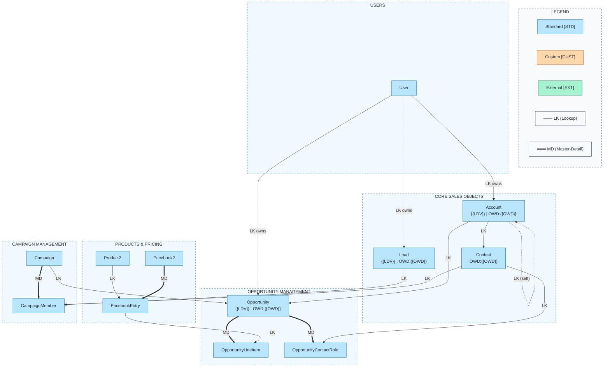

# Sales Cloud ERD Template

Pre-built data model for Salesforce Sales Cloud with object type indicators, relationship labels, and metadata placeholders.

## Objects Included

| Object | Type | Description |
|--------|------|-------------|
| Account | STD | Companies and organizations |
| Contact | STD | People associated with accounts |
| Lead | STD | Potential customers |
| Opportunity | STD | Sales deals and revenue |
| OpportunityLineItem | STD | Products on opportunities |
| OpportunityContactRole | STD | Contact roles on opportunities |
| Product2 | STD | Product catalog |
| Pricebook2 | STD | Price lists |
| PricebookEntry | STD | Product prices |
| Campaign | STD | Marketing campaigns |
| CampaignMember | STD | Campaign responses |
| User | STD | Salesforce users |

---

## Query Org Metadata (Recommended)

Enrich diagram with live org data:

```bash
python3 ~/.claude/plugins/marketplaces/sf-skills/sf-diagram/scripts/query-org-metadata.py \
    --objects Account,Contact,Lead,Opportunity,OpportunityLineItem,Product2,Campaign \
    --target-org myorg \
    --output table \
    --mermaid
```

Replace `{{LDV}}` and `{{OWD}}` placeholders with actual values from query output.

---

## Mermaid erDiagram (Standard Format)

Standard ERD notation with relationship type labels (`LK`=Lookup, `MD`=Master-Detail).

```mermaid
%%{init: {'theme': 'base', 'themeVariables': {
  'primaryColor': '#bae6fd',
  'primaryTextColor': '#1f2937',
  'primaryBorderColor': '#0369a1',
  'lineColor': '#334155'
}}}%%
erDiagram
    %% ════════════════════════════════════════════════════════════════════════════
    %% SALES CLOUD DATA MODEL
    %%
    %% LEGEND - Object Types:
    %%   [STD]  = Standard Object (Blue in flowchart)
    %%   [CUST] = Custom Object (Orange in flowchart)
    %%   [EXT]  = External Object (Green in flowchart)
    %%
    %% LEGEND - Relationship Types:
    %%   LK = Lookup (optional parent, no cascade delete)
    %%   MD = Master-Detail (required parent, cascade delete, roll-up enabled)
    %% ════════════════════════════════════════════════════════════════════════════

    %% ─────────────────────────────────────────────────────────────────────────────
    %% CORE SALES OBJECTS
    %% ─────────────────────────────────────────────────────────────────────────────

    Account ||--o{ Contact : "LK - has many"
    Account ||--o{ Opportunity : "LK - has many"
    Account ||--o{ Account : "LK - parent of"

    Account {
        Id Id PK "[STD] {{LDV}}"
        Text Name "Required"
        Lookup ParentId FK "Account (Self)"
        Lookup OwnerId FK "User"
        Picklist Industry
        Picklist Type
        Currency AnnualRevenue
        Phone Phone
        Text BillingCity
        Text BillingState
        Text __metadata__ "{{OWD}}"
    }

    Contact {
        Id Id PK "[STD]"
        Lookup AccountId FK "Account"
        Lookup OwnerId FK "User"
        Lookup ReportsToId FK "Contact (Self)"
        Text FirstName
        Text LastName "Required"
        Email Email
        Phone Phone
        Text Title
        Text __metadata__ "{{OWD}}"
    }

    Lead {
        Id Id PK "[STD] {{LDV}}"
        Text FirstName
        Text LastName "Required"
        Text Company "Required"
        Email Email
        Phone Phone
        Picklist Status "Required"
        Picklist LeadSource
        Lookup OwnerId FK "User"
        Text __metadata__ "{{OWD}}"
    }

    %% ─────────────────────────────────────────────────────────────────────────────
    %% OPPORTUNITY OBJECTS
    %% ─────────────────────────────────────────────────────────────────────────────

    Opportunity ||--o{ OpportunityLineItem : "MD - contains"
    Opportunity ||--o{ OpportunityContactRole : "MD - involves"
    Contact ||--o{ OpportunityContactRole : "LK - plays role"

    Opportunity {
        Id Id PK "[STD] {{LDV}}"
        Lookup AccountId FK "Account"
        Lookup OwnerId FK "User"
        Lookup CampaignId FK "Campaign"
        Text Name "Required"
        Picklist StageName "Required"
        Date CloseDate "Required"
        Currency Amount
        Number Probability
        Picklist ForecastCategory
        Picklist LeadSource
        Text __metadata__ "{{OWD}}"
    }

    OpportunityContactRole {
        Id Id PK "[STD]"
        MasterDetail OpportunityId FK "Opportunity"
        Lookup ContactId FK "Contact"
        Picklist Role
        Checkbox IsPrimary
    }

    OpportunityLineItem {
        Id Id PK "[STD]"
        MasterDetail OpportunityId FK "Opportunity"
        Lookup PricebookEntryId FK "PricebookEntry"
        Number Quantity "Required"
        Currency UnitPrice
        Currency TotalPrice
        Text Description
    }

    %% ─────────────────────────────────────────────────────────────────────────────
    %% PRODUCT & PRICING
    %% ─────────────────────────────────────────────────────────────────────────────

    Product2 ||--o{ PricebookEntry : "LK - priced in"
    Pricebook2 ||--o{ PricebookEntry : "MD - contains"
    PricebookEntry ||--o{ OpportunityLineItem : "LK - used in"

    Product2 {
        Id Id PK "[STD]"
        Text Name "Required"
        Text ProductCode
        Text Description
        Checkbox IsActive "Required"
        Picklist Family
    }

    Pricebook2 {
        Id Id PK "[STD]"
        Text Name "Required"
        Checkbox IsActive
        Checkbox IsStandard
    }

    PricebookEntry {
        Id Id PK "[STD]"
        Lookup Product2Id FK "Product2"
        MasterDetail Pricebook2Id FK "Pricebook2"
        Currency UnitPrice "Required"
        Checkbox IsActive
    }

    %% ─────────────────────────────────────────────────────────────────────────────
    %% CAMPAIGN MANAGEMENT
    %% ─────────────────────────────────────────────────────────────────────────────

    Campaign ||--o{ CampaignMember : "MD - has members"
    Lead }o--o{ CampaignMember : "via junction"
    Contact }o--o{ CampaignMember : "via junction"
    Campaign ||--o{ Opportunity : "LK - sourced from"

    Campaign {
        Id Id PK "[STD]"
        Text Name "Required"
        Lookup ParentId FK "Campaign (Self)"
        Picklist Type
        Picklist Status
        Date StartDate
        Date EndDate
        Currency ExpectedRevenue
        Currency ActualCost
        Number NumberOfLeads
        Number NumberOfConvertedLeads
    }

    CampaignMember {
        Id Id PK "[STD]"
        MasterDetail CampaignId FK "Campaign"
        Lookup LeadId FK "Lead"
        Lookup ContactId FK "Contact"
        Picklist Status
        Date FirstRespondedDate
    }

    %% ─────────────────────────────────────────────────────────────────────────────
    %% USER OWNERSHIP
    %% ─────────────────────────────────────────────────────────────────────────────

    User ||--o{ Account : "LK - owns"
    User ||--o{ Contact : "LK - owns"
    User ||--o{ Lead : "LK - owns"
    User ||--o{ Opportunity : "LK - owns"

    User {
        Id Id PK "[STD]"
        Text Username "Required, Unique"
        Text FirstName
        Text LastName "Required"
        Email Email "Required"
        Checkbox IsActive
        Lookup ProfileId FK "Profile"
        Lookup UserRoleId FK "UserRole"
        Lookup ManagerId FK "User (Self)"
    }
```

---

## Mermaid Flowchart (With Color Coding)

Use this format when visual distinction of object types is required.



---

## ASCII Fallback

Terminal-friendly representation for documentation:

```
╔══════════════════════════════════════════════════════════════════════════════╗
║                        SALES CLOUD DATA MODEL                                 ║
╠══════════════════════════════════════════════════════════════════════════════╣
║  LEGEND:                                                                      ║
║    [STD] = Standard Object    LK = Lookup      ─── = Lookup                  ║
║    [CUST] = Custom Object     MD = Master-Det  ═══ = Master-Detail           ║
║    [EXT] = External Object                                                    ║
╚══════════════════════════════════════════════════════════════════════════════╝

┌─────────────────────────┐      ┌─────────────────────────┐
│       ACCOUNT [STD]     │      │      CONTACT [STD]      │
│  {{LDV}} | OWD:{{OWD}}  │──LK──│     OWD:{{OWD}}         │
├─────────────────────────┤      ├─────────────────────────┤
│ Id (PK)                 │      │ Id (PK)                 │
│ Name (Required)         │      │ AccountId (FK→Account)  │
│ ParentId (FK→Account)   │      │ LastName (Required)     │
│ OwnerId (FK→User)       │      │ Email                   │
│ Industry                │      │ OwnerId (FK→User)       │
└──────────┬──────────────┘      └─────────────────────────┘
           │
           │ LK
           ▼
┌─────────────────────────┐      ┌─────────────────────────┐
│    OPPORTUNITY [STD]    │══MD══│  OPPORTUNITY_LINE_ITEM  │
│  {{LDV}} | OWD:{{OWD}}  │      │         [STD]           │
├─────────────────────────┤      ├─────────────────────────┤
│ Id (PK)                 │      │ Id (PK)                 │
│ AccountId (FK→Account)  │      │ OpportunityId (FK→Opp)  │
│ Name (Required)         │      │ PricebookEntryId (FK)   │
│ StageName (Required)    │      │ Quantity (Required)     │
│ CloseDate (Required)    │      │ TotalPrice              │
│ Amount                  │      │                         │
└──────────┬──────────────┘      └─────────────────────────┘
           │
           │ MD
           ▼
┌─────────────────────────┐
│ OPPORTUNITY_CONTACT_ROLE│
│         [STD]           │
├─────────────────────────┤
│ Id (PK)                 │
│ OpportunityId (MD→Opp)  │
│ ContactId (LK→Contact)  │
│ Role                    │
│ IsPrimary               │
└─────────────────────────┘

┌─────────────────────────┐      ┌─────────────────────────┐
│     PRODUCT2 [STD]      │──LK──│   PRICEBOOK_ENTRY [STD] │
├─────────────────────────┤      ├─────────────────────────┤
│ Id (PK)                 │      │ Id (PK)                 │
│ Name (Required)         │      │ Product2Id (FK)         │
│ ProductCode             │      │ Pricebook2Id (MD)       │
│ IsActive                │      │ UnitPrice (Required)    │
└─────────────────────────┘      └─────────────────────────┘
                                          ▲
                                          │ MD
┌─────────────────────────┐               │
│    PRICEBOOK2 [STD]     │═══════════════╯
├─────────────────────────┤
│ Id (PK)                 │
│ Name (Required)         │
│ IsStandard              │
│ IsActive                │
└─────────────────────────┘

┌─────────────────────────┐      ┌─────────────────────────┐
│     CAMPAIGN [STD]      │══MD══│  CAMPAIGN_MEMBER [STD]  │
├─────────────────────────┤      ├─────────────────────────┤
│ Id (PK)                 │      │ Id (PK)                 │
│ Name (Required)         │      │ CampaignId (MD)         │
│ Type                    │      │ LeadId (LK→Lead)        │
│ Status                  │      │ ContactId (LK→Contact)  │
│ StartDate               │      │ Status                  │
│ ExpectedRevenue         │      └─────────────────────────┘
└─────────────────────────┘

┌─────────────────────────┐
│        LEAD [STD]       │
│  {{LDV}} | OWD:{{OWD}}  │
├─────────────────────────┤
│ Id (PK)                 │
│ LastName (Required)     │
│ Company (Required)      │
│ Status (Required)       │
│ LeadSource              │
│ OwnerId (FK→User)       │
└─────────────────────────┘
```

---

## Placeholder Reference

| Placeholder | Query | Example Value |
|-------------|-------|---------------|
| `{{LDV}}` | `sf data query --query "SELECT COUNT() FROM X"` | `LDV[~4M]` or empty |
| `{{OWD}}` | `sf sobject describe --sobject X` → `sharingModel` | `Private`, `ReadWrite`, `Parent` |

---

## Key Relationships Summary

| Parent | Child | Type | Notes |
|--------|-------|------|-------|
| Account | Contact | LK | Contacts can exist without Account |
| Account | Opportunity | LK | Opportunities can exist without Account |
| Account | Account | LK | Self-referential for hierarchy |
| Opportunity | OpportunityLineItem | MD | Cascade delete, roll-up enabled |
| Opportunity | OpportunityContactRole | MD | Cascade delete |
| Product2 | PricebookEntry | LK | Products linked to pricing |
| Pricebook2 | PricebookEntry | MD | Price books own entries |
| Campaign | CampaignMember | MD | Cascade delete |
| Campaign | Opportunity | LK | Primary campaign source |

---

## Customization

### Add Custom Objects

1. Add entity with `[CUST]` indicator
2. In flowchart, use orange styling: `fill:#fed7aa,stroke:#c2410c`
3. Add to appropriate subgraph or create new one

### Add External Objects

1. Add entity with `[EXT]` indicator
2. In flowchart, use green styling: `fill:#a7f3d0,stroke:#047857`
3. Note: External objects don't support COUNT() queries

### Example: Adding Invoice__c Custom Object

```mermaid
    subgraph cust["CUSTOM OBJECTS"]
        Invoice["Invoice__c<br/>OWD:Private"]
    end

    Account ==>|"MD"| Invoice

    style Invoice fill:#fed7aa,stroke:#c2410c,color:#1f2937
    style cust fill:#fff7ed,stroke:#c2410c,stroke-dasharray:5
```
