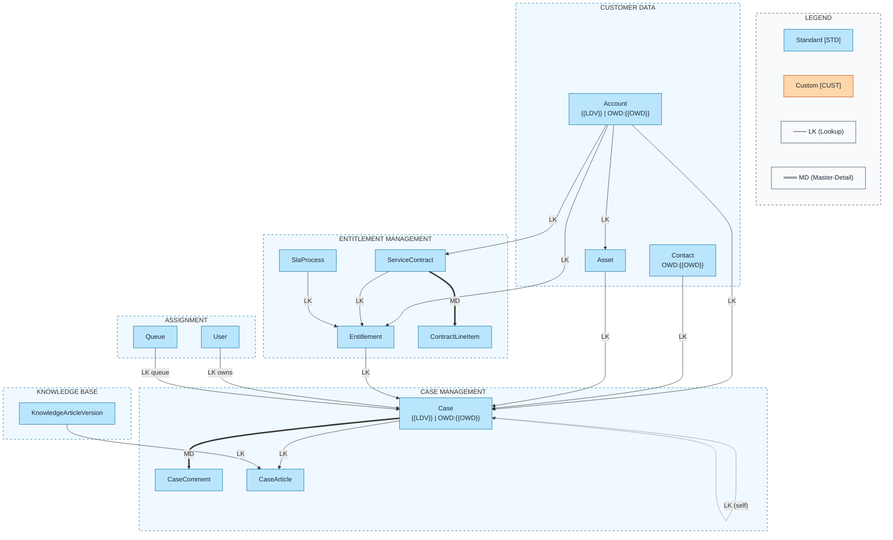

# Service Cloud ERD Template

Pre-built data model for Salesforce Service Cloud with case management, entitlements, knowledge, and service contracts.

## Objects Included

| Object | Type | Description |
|--------|------|-------------|
| Account | STD | Customer accounts |
| Contact | STD | Customer contacts |
| Case | STD | Support cases/tickets |
| CaseComment | STD | Internal/public case comments |
| CaseHistory | STD | Case field change tracking |
| Entitlement | STD | Support entitlements |
| ServiceContract | STD | Service agreements |
| ContractLineItem | STD | Contract products |
| SlaProcess | STD | Entitlement process |
| KnowledgeArticleVersion | STD | Knowledge base articles |
| CaseArticle | STD | Case-article junction |
| Group (Queue) | STD | Case queues |
| User | STD | Support agents |

---

## Query Org Metadata (Recommended)

Enrich diagram with live org data:

```bash
python3 ~/.claude/plugins/marketplaces/sf-skills/sf-diagram/scripts/query-org-metadata.py \
    --objects Account,Contact,Case,CaseComment,Entitlement,ServiceContract \
    --target-org myorg \
    --output table \
    --mermaid
```

---

## Mermaid erDiagram (Standard Format)

```mermaid
%%{init: {'theme': 'base', 'themeVariables': {
  'primaryColor': '#bae6fd',
  'primaryTextColor': '#1f2937',
  'primaryBorderColor': '#0369a1',
  'lineColor': '#334155'
}}}%%
erDiagram
    %% ════════════════════════════════════════════════════════════════════════════
    %% SERVICE CLOUD DATA MODEL
    %%
    %% LEGEND - Relationship Types:
    %%   LK = Lookup (optional parent, no cascade delete)
    %%   MD = Master-Detail (required parent, cascade delete)
    %% ════════════════════════════════════════════════════════════════════════════

    %% ─────────────────────────────────────────────────────────────────────────────
    %% CASE MANAGEMENT
    %% ─────────────────────────────────────────────────────────────────────────────

    Account ||--o{ Case : "LK - has cases"
    Contact ||--o{ Case : "LK - reports"
    Case ||--o{ Case : "LK - parent of"
    Case ||--o{ CaseComment : "MD - has comments"
    Entitlement ||--o{ Case : "LK - covers"

    Account {
        Id Id PK "[STD] {{LDV}}"
        Text Name "Required"
        Lookup OwnerId FK "User"
        Phone Phone
        Text BillingCity
        Text __metadata__ "{{OWD}}"
    }

    Contact {
        Id Id PK "[STD]"
        Lookup AccountId FK "Account"
        Text LastName "Required"
        Email Email
        Phone Phone
        Text __metadata__ "{{OWD}}"
    }

    Case {
        Id Id PK "[STD] {{LDV}}"
        Text CaseNumber "Auto-Number"
        Lookup AccountId FK "Account"
        Lookup ContactId FK "Contact"
        Lookup OwnerId FK "User, Queue"
        Lookup ParentId FK "Case (Self)"
        Lookup EntitlementId FK "Entitlement"
        Lookup AssetId FK "Asset"
        Text Subject
        TextArea Description
        Picklist Status "Required"
        Picklist Priority
        Picklist Origin "Required"
        Picklist Type
        Picklist Reason
        Checkbox IsClosed
        Checkbox IsEscalated
        DateTime ClosedDate
        Text __metadata__ "{{OWD}}"
    }

    CaseComment {
        Id Id PK "[STD]"
        MasterDetail ParentId FK "Case"
        TextArea CommentBody
        Checkbox IsPublished
        Lookup CreatedById FK "User"
        DateTime CreatedDate
    }

    %% ─────────────────────────────────────────────────────────────────────────────
    %% ENTITLEMENT MANAGEMENT
    %% ─────────────────────────────────────────────────────────────────────────────

    Account ||--o{ Entitlement : "LK - entitled to"
    ServiceContract ||--o{ Entitlement : "LK - includes"
    ServiceContract ||--o{ ContractLineItem : "MD - contains"
    Account ||--o{ ServiceContract : "LK - has contracts"
    SlaProcess ||--o{ Entitlement : "LK - governs"

    Entitlement {
        Id Id PK "[STD]"
        Text Name "Required"
        Lookup AccountId FK "Account"
        Lookup ServiceContractId FK "ServiceContract"
        Lookup SlaProcessId FK "SlaProcess"
        Lookup AssetId FK "Asset"
        Date StartDate
        Date EndDate
        Picklist Type
        Number RemainingCases
        Number RemainingWorkOrders
        Checkbox IsPerIncident
    }

    ServiceContract {
        Id Id PK "[STD]"
        Text Name "Required"
        Text ContractNumber "Auto-Number"
        Lookup AccountId FK "Account"
        Lookup ContactId FK "Contact"
        Date StartDate
        Date EndDate
        Date ActivationDate
        Picklist Status
        Picklist ApprovalStatus
        Currency Discount
        Currency GrandTotal
    }

    ContractLineItem {
        Id Id PK "[STD]"
        MasterDetail ServiceContractId FK "ServiceContract"
        Lookup Product2Id FK "Product2"
        Lookup PricebookEntryId FK "PricebookEntry"
        Lookup AssetId FK "Asset"
        Text LineItemNumber "Required"
        Number Quantity
        Currency UnitPrice
        Currency TotalPrice
        Date StartDate
        Date EndDate
    }

    SlaProcess {
        Id Id PK "[STD]"
        Text Name "Required"
        Picklist SobjectType "Case/WorkOrder"
        Checkbox IsActive
        Text Description
    }

    %% ─────────────────────────────────────────────────────────────────────────────
    %% KNOWLEDGE MANAGEMENT
    %% ─────────────────────────────────────────────────────────────────────────────

    KnowledgeArticleVersion ||--o{ CaseArticle : "via junction"
    Case ||--o{ CaseArticle : "via junction"

    KnowledgeArticleVersion {
        Id Id PK "[STD]"
        Text Title "Required"
        TextArea Summary
        Text ArticleNumber
        Text UrlName "URL-friendly name"
        Picklist PublishStatus "Draft/Published/Archived"
        Picklist Language
        Number VersionNumber
        DateTime FirstPublishedDate
        DateTime LastPublishedDate
        Checkbox IsLatestVersion
        Checkbox IsVisibleInApp
        Checkbox IsVisibleInPkb
        Checkbox IsVisibleInCsp
    }

    CaseArticle {
        Id Id PK "[STD]"
        Lookup CaseId FK "Case"
        Lookup KnowledgeArticleVersionId FK "KnowledgeArticleVersion"
        DateTime ArticleCreatedDate
    }

    %% ─────────────────────────────────────────────────────────────────────────────
    %% ASSETS (Customer Installed Products)
    %% ─────────────────────────────────────────────────────────────────────────────

    Account ||--o{ Asset : "LK - owns"
    Contact ||--o{ Asset : "LK - uses"
    Asset ||--o{ Case : "LK - related to"

    Asset {
        Id Id PK "[STD]"
        Text Name "Required"
        Lookup AccountId FK "Account"
        Lookup ContactId FK "Contact"
        Lookup Product2Id FK "Product2"
        Lookup ParentId FK "Asset (Self)"
        Text SerialNumber
        Date InstallDate
        Date PurchaseDate
        Date UsageEndDate
        Picklist Status
        Currency Price
        Number Quantity
    }

    %% ─────────────────────────────────────────────────────────────────────────────
    %% QUEUE & USER ASSIGNMENT
    %% ─────────────────────────────────────────────────────────────────────────────

    User ||--o{ Case : "LK - owns/assigned"
    Group ||--o{ Case : "LK - queue assignment"

    User {
        Id Id PK "[STD]"
        Text Username "Required, Unique"
        Text LastName "Required"
        Email Email "Required"
        Checkbox IsActive
        Lookup ProfileId FK "Profile"
    }

    Group {
        Id Id PK "[STD]"
        Text Name "Required"
        Picklist Type "Queue"
        Email Email "Queue email"
        Checkbox DoesIncludeBosses
    }
```

---

## Mermaid Flowchart (With Color Coding)



---

## ASCII Fallback

```
╔══════════════════════════════════════════════════════════════════════════════╗
║                       SERVICE CLOUD DATA MODEL                                ║
╠══════════════════════════════════════════════════════════════════════════════╣
║  LEGEND:                                                                      ║
║    [STD] = Standard Object     LK = Lookup        ─── = Lookup               ║
║    [CUST] = Custom Object      MD = Master-Det    ═══ = Master-Detail        ║
╚══════════════════════════════════════════════════════════════════════════════╝

┌─────────────────────────┐      ┌─────────────────────────┐
│      ACCOUNT [STD]      │──LK──│      CONTACT [STD]      │
│  {{LDV}} | OWD:{{OWD}}  │      │     OWD:{{OWD}}         │
├─────────────────────────┤      ├─────────────────────────┤
│ Id (PK)                 │      │ Id (PK)                 │
│ Name (Required)         │      │ AccountId (FK→Account)  │
│ OwnerId (FK→User)       │      │ LastName (Required)     │
│ Phone                   │      │ Email                   │
└──────────┬──────────────┘      └──────────┬──────────────┘
           │                                 │
           │ LK                              │ LK
           ▼                                 ▼
┌─────────────────────────────────────────────────────────────┐
│                         CASE [STD]                           │
│                 {{LDV}} | OWD:{{OWD}}                        │
├─────────────────────────────────────────────────────────────┤
│ Id (PK)                    │ Subject                         │
│ CaseNumber (Auto)          │ Description                     │
│ AccountId (FK→Account)     │ Status (Required)               │
│ ContactId (FK→Contact)     │ Priority                        │
│ OwnerId (FK→User/Queue)    │ Origin (Required)               │
│ ParentId (FK→Case)         │ IsClosed                        │
│ EntitlementId (FK→Ent)     │ IsEscalated                     │
└──────────┬─────────────────┴──────────────┬─────────────────┘
           │                                 │
           │ MD                              │ LK (junction)
           ▼                                 ▼
┌─────────────────────────┐      ┌─────────────────────────┐
│   CASE_COMMENT [STD]    │      │    CASE_ARTICLE [STD]   │
├─────────────────────────┤      ├─────────────────────────┤
│ Id (PK)                 │      │ Id (PK)                 │
│ ParentId (MD→Case)      │      │ CaseId (LK→Case)        │
│ CommentBody             │      │ KnowledgeArticleId (LK) │
│ IsPublished             │      │                         │
└─────────────────────────┘      └──────────┬──────────────┘
                                            │ LK
                                            ▼
                                 ┌─────────────────────────┐
                                 │ KNOWLEDGE_ARTICLE [STD] │
                                 ├─────────────────────────┤
                                 │ Id (PK)                 │
                                 │ Title (Required)        │
                                 │ ArticleNumber           │
                                 │ PublishStatus           │
                                 │ IsLatestVersion         │
                                 └─────────────────────────┘

┌─────────────────────────────────────────────────────────────┐
│                   ENTITLEMENT MANAGEMENT                     │
├─────────────────────────────────────────────────────────────┤

┌─────────────────────────┐      ┌─────────────────────────┐
│   ENTITLEMENT [STD]     │──LK──│     SLA_PROCESS [STD]   │
├─────────────────────────┤      ├─────────────────────────┤
│ Id (PK)                 │      │ Id (PK)                 │
│ Name (Required)         │      │ Name (Required)         │
│ AccountId (FK→Account)  │      │ SobjectType             │
│ ServiceContractId (FK)  │      │ IsActive                │
│ SlaProcessId (FK→SLA)   │      │                         │
│ StartDate               │      └─────────────────────────┘
│ EndDate                 │
│ RemainingCases          │
└──────────┬──────────────┘
           │ LK
           ▼
┌─────────────────────────┐      ┌─────────────────────────┐
│  SERVICE_CONTRACT [STD] │══MD══│ CONTRACT_LINE_ITEM [STD]│
├─────────────────────────┤      ├─────────────────────────┤
│ Id (PK)                 │      │ Id (PK)                 │
│ Name (Required)         │      │ ServiceContractId (MD)  │
│ ContractNumber (Auto)   │      │ Product2Id (FK)         │
│ AccountId (FK→Account)  │      │ Quantity                │
│ StartDate               │      │ UnitPrice               │
│ EndDate                 │      │ TotalPrice              │
│ Status                  │      │                         │
└─────────────────────────┘      └─────────────────────────┘
```

---

## Key Relationships Summary

| Parent | Child | Type | Notes |
|--------|-------|------|-------|
| Account | Case | LK | Customer relationship |
| Contact | Case | LK | Reporter/requestor |
| Case | Case | LK | Parent-child hierarchy |
| Case | CaseComment | MD | Comments cascade delete |
| Entitlement | Case | LK | SLA coverage |
| Account | Entitlement | LK | Customer entitlements |
| ServiceContract | Entitlement | LK | Contract includes entitlements |
| ServiceContract | ContractLineItem | MD | Contract products |
| SlaProcess | Entitlement | LK | Entitlement process |
| Case | CaseArticle | LK | Junction to Knowledge |
| User/Queue | Case | LK | Assignment |

---

## Service Cloud Specific Patterns

### Case Escalation Path

```
Case (Open) → Case (Escalated) → Case (Closed)
      │              │
      └──────────────┴── CaseHistory tracks changes
```

### Entitlement Coverage Flow

```
Account → ServiceContract → Entitlement → Case
    │                            │
    └────────────────────────────┘
              Direct entitlement
```

### Knowledge Deflection

```
Customer → Search Knowledge → CaseArticle → Case
                  │
                  └── Self-service resolution
```

---

## Customization

### Add Custom Case Fields

Extend the Case entity with custom fields:

```mermaid
    Case {
        Id Id PK "[STD] {{LDV}}"
        %% ... standard fields ...
        Text Custom_Field__c "[CUST] Custom tracking"
    }
```

### Add Integration Object

For external ticketing system integration:

```mermaid
    subgraph ext["EXTERNAL SYSTEMS"]
        ExternalTicket["External_Ticket__x"]
    end

    Case -->|"LK"| ExternalTicket

    style ExternalTicket fill:#a7f3d0,stroke:#047857,color:#1f2937
    style ext fill:#ecfdf5,stroke:#047857,stroke-dasharray:5
```
